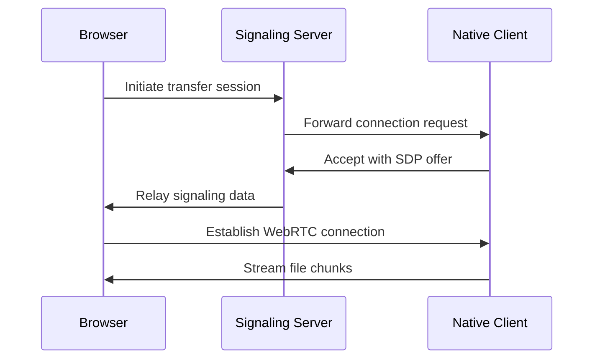

# Product Context

## Problem Space
- Enables direct device-to-device transfers without cloud storage
- Solves large file sharing challenges in restricted network environments
- Bridges browser-initiated transfers with native client capabilities

## Key User Journeys

## Success Metrics
- 90%+ successful NAT traversal
- Sub-5 second connection establishment
- >100MB/s transfer speeds on LAN
