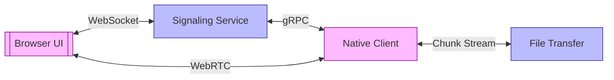

# System Architecture Patterns

## Core Subsystems

## Key Flows
1. **Signaling Initiation**
   - Browser establishes WebSocket connection
   - SDP offer/answer exchange
   - ICE candidate negotiation

2. **File Transfer**
   - Chunk segmentation (256KB blocks)
   - Checksum verification
   - Resume capability via offset tracking
